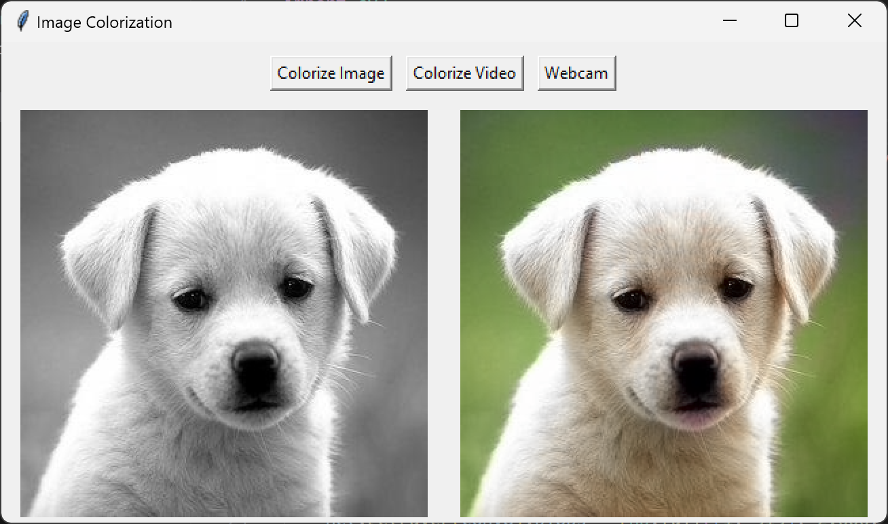

# Image Colorization using Deep Learning

This project provides a simple GUI application to colorize grayscale images using deep learning techniques. It utilizes a pre-trained model to predict the color values for grayscale images.

## Features
- Colorize single images
- Colorize videos
- Colorize webcam stream in real-time

## Prerequisites
- Python 3.x
- OpenCV (cv2)
- tkinter
- numpy
- PIL (Pillow)

## Installation
1. Clone the repository:
   ```
   git clone https://github.com/varun7778/BreadcrumbsColorization-using-Deep-Learning.git
   ```

2. Install the required dependencies:
   ```
   pip install opencv-python-headless opencv-python-headless numpy pillow
   ```

## Usage
1. Run the script `colorize.py`:

   ```
   python colorize.py
   ```

2. Use the GUI to select the desired option (colorize image, colorize video, or webcam).

3. For image and video colorization, a file dialog will prompt you to select the target file. For webcam colorization, the webcam feed will start automatically.

4. The colorized output will be displayed in the GUI.

## Model
The colorization model used in this project is based on the following files:
- `colorization_deploy_v2.prototxt`: Model architecture description.
- `colorization_release_v2.caffemodel`: Pre-trained weights.
- `pts_in_hull.npy`: Cluster centers for k-means clustering.

These files are included in the `model` directory.

## Working
Below is the working of the model with a simple GUI with 3 buttons one for image, video and webcam respectively.


## Accuracy
- Mean Squared Error (MSE): 15.597761044176707
- Peak Signal-to-Noise Ratio (PSNR): 36.20018098150905
- Structural Similarity Index (SSIM): 0.9980466894129395


## Acknowledgements
This project utilizes the following resources:
- [OpenCV](https://opencv.org/): Open Source Computer Vision Library.
- [PIL (Python Imaging Library)](https://python-pillow.org/): Python Imaging Library.
- [tkinter](https://docs.python.org/3/library/tkinter.html): Python's de-facto standard GUI (Graphical User Interface) package.
